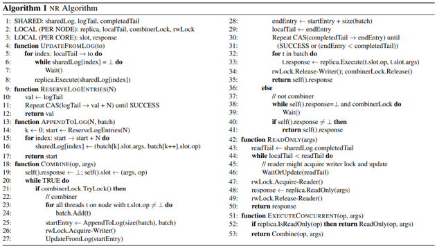

# Black-box Concurrent Data Structures for NUMA Architectures

# 背景

当前高性能服务器都是NUMA机器

全局数据时常需要在不同线程或者说numa节点中进行共享。比如操作系统中的内存管理的数据，多核应用的全局数据等。这些数据都需要较好的并行性支持（Concurrent data structure）。

关键在于更好的扩展性和并行性， 与编程难度之间的平衡

# 相关工作

•锁或者cas等方式来自己写，自由度很高但是对NUMA并不敏感，这将可能损害整体的性能

•已有的black-box方法，如Flat combining (w/o RWL)，他们并不是为NUMA开发，仍然容易受到NUMA结构的影响而损失性能。

•NUMA-aware algorithm, 针对特定数据结构开发，不通用而且很少。

# 设计

•提出了一种能够适应NUMA结构的黑箱算法，能够比较方便地实现数据结构的并行，并获得很好的性能。

>  参考分布式系统：每个节点实现一个数据备份（replica），使用一个共享的日志来进行同步
>
> 参考共享内存算法：采取层次化的numa感知设计实现的日志来实现可序列化级别的一致性

## 结构

需要数据结构提供接口，然后就能够比较方便的使用他的算法，得到一致性。

`Create`将产生一个这个数据结构的实例。

而`Execute`将执行对传入的数据实例（ptr）执行操作（op，如push， pop等），可以参数（args）。

`IsReadOnly`则用来判断一个操作是不是只读的。

然后当我们想要修改这个数据实例的时候调用他们提供的**ExecuteConcurrent**来代替Execute就可以了。

## 节点内部一致性

•执行者（ combiner 整合者？），**每个节点同一时间都只有一个线程能够成为执行者，而只有执行者才能执行修改日志和备份的操作。获得锁**并写玩日志后会获取节点内写者锁。

•写操作会首先把操作和参数存放到当前cpu对应的一个预留位置。执行者获取当前的所有待执行任务，记录到日志中，并把日志依次执行，直到当前任务完成。

## 节点间一致性

•按照日志顺序执行每个日志项的操作。

•用写操作进入日志的时候，日志的末尾的位置作为这个操作执行的时间顺序。

•如果说在执行过程中日志中有新的写入，那也认为那是“未来”的事情。

## 只读优化

•只读操作的并行

•读操作则尝试把他当作写操作执行（避免空等写操作到来）

•不然就等日志执行到进入函数的位置，尝试获取读者锁执行。

•主要不同在于使用的是进入函数时，日志第一条未被执行的日志的位置completedTail作为读操作的“发生时间”。只要当前备份更新到超过这个时间就算足够新了。

•这个操作主要是因为读操作不会留在日志中，需要一个位置来作为操作发生时间，保证可序列化。而他只要保证所读的是进入函数时，所有备份中最新的那份（>completedTail，认为足够新）。

•更新的时候一次更新一批待执行日志，但不会坚持去执行完所有日志。

# 算法

## 数据结构

**全局**

•日志shareLog

•日志记录下标logTail，表示当前最后写的位置

•日志第一个未执行的位置completedTail

**每个节点一个**

•数据备份

•下标logTail，表示当前备份执行到日志的位置

•整合锁，每个节点一个，获取到就去整合（执行日志，执行excute操作），不然就等其他人做完就行。

•读写锁，执行前需要根据类型获取。Excute需要写锁，不然读锁就行

每个cpu核心

•Slot 和response，用来存储当前任务和结果

## 逻辑

执行excute的时候，

首先判断操作是否只读，是则记录当前全局最新备份的版本comletedTail，等待或成为执行者更新当前备份版本localTail到足够新的版本。

然后尝试获取读者锁，然后执行，释放锁。

如果是执行操作，

1.记录当前操作到指定区域。

2.尝试获取执行者锁，成为执行者。或者是等别人执行完。

3.搜集所有线程的待执行任务，写到日志中，

4.获取写者锁，更新当前备份版本，如果当前版本为全局最新则尝试更新全局最新为当前版本。

5.执行所收集的所有任务。

6.释放所有锁

# 优化细节

## 优化

•改进分布式读写锁

•每个cpu有一个锁（称为读者锁），写者锁就是要获取所有的读者锁。

•改进为：有一个写者锁，写者去获取这个锁，然后等所有读者锁释放即可。释放的时候释放这个写者锁即可。读者获取锁的时候，先等待写者锁释放，然后获取读者锁，再检查一次写者锁。被锁则释放，否则开始使用。   这样的话，读者写者都只要进行一次原子写就可以了。而因为写者只会有一个且很多工作在非关键区（写日志），不会导致读者饥饿的情况。

•循环日志队列

•对架构的优化-比如对齐之类的

## 具体可能遇到的问题

•线程数量，允许比核数更多的线程，形成更大的批处理，提高效率。

•日志长度，或许可以动态扩展，但是并没有。实际是一个1M容量的循环队列。

•近cpu申请内存。

•有时候可能某个节点长时间没更新，导致日志爆满。设定一个线程，定时执行下一次。但是一般应用不需要这个。

•多种数据结构混合。可以组合成一个包含他们的数据结构。

## 结果

## 常用数据结构测试

•基本上都取得最好的效果。

•以Skip list priority queue为例

•在无更新操作的时候，LF没有锁开销一枝独秀，NR，FC+以及RWL都采用RWL差在需要获取锁的开销，而NR则进一步需要检查日志，是不是最新备份。

•10%更新的时候，大家都会受到NUMA的影响而性能下降。但NR在线程超过一个节点（28个超线程）的时候性能损失更少。比其他方法好1.7x-41x

•在需要一直更新的时候，大家的性能损失都相当严重。不过同样，NR损失更少。2.4x-9.4x。

•每次读写的时候在这个数据结构外围写e个随机位置的时候，SL就没有这个效果了。解释是可以造成cache污染的效果。

•但一些特定的结构，如栈，在NA使用特定技术消元（elimination）来优化的情况下能够比NR好很多之外。（取得几乎是线性的扩展能力）

## 其他并行数据结构对比扩展性

•数据结构：一个简单的n=200K个元素的buffer，每个操作会访问其中固定的一个元素（模拟指针，比如树的根之类的角色），然后剩余的（C-1 = 7）个元素则是均匀随机地访问。

•可以看到，核数比较少地时候，还有FC，FC+，RWL可以稍微跟NR相比，但是在线程数逐渐增大，NR的表现会逐渐地变得突出。在10%更新的情况下能达到4x的加速

## 实际应用测试

•实际应用redis测试

•读写混合的YCSB benchmark来做测试

•先创建一个10000个元素的排序集。用多个线程不断地对他进行读或更新随机（均匀分布）个元素。

•可以看到较低更新率的时候，NR的吞吐率都是最高的。能够获得2.6x-14x的加速比。

而较高更新率的时候，NR的性能也几乎没有损失。能够获得1.1x-4.4x的加速比

## 优化选项效果

•每个改进的效果，可以看到

•#4并行更新备份（如果让所有）有效改进跨node读写的时候的性能

•#1和#5的改进有效的改进节点内的效果。

•#3中可以看到允许读者在执行者写日志的时候工作的能有比较好的效果。

# 参考资料

[Black-box Concurrent Data Structures for NUMA Architectures](https://dl.acm.org/doi/10.1145/3093336.3037721)

